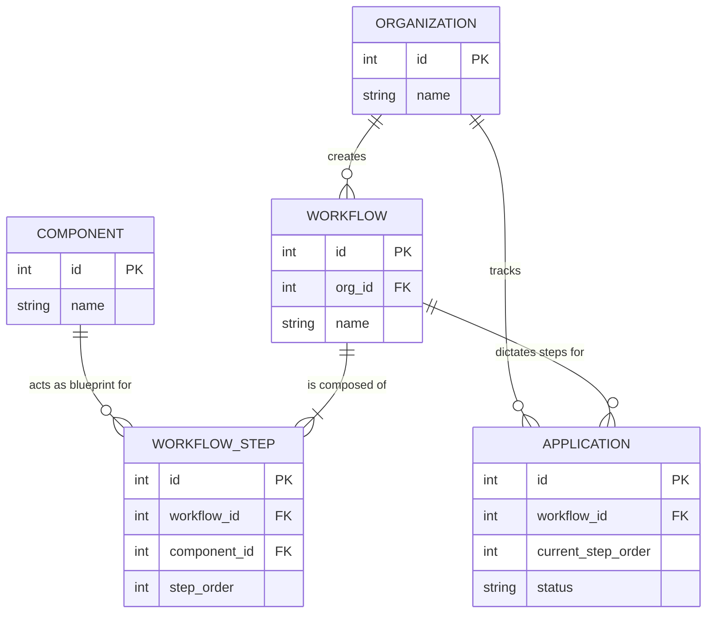

# ISO Workflow System (Multi-Organization)

This project is a multi-tenant dynamic Workflow Engine built to solve the rigidity of traditional certification systems. It allows independent organizations (Certification Bodies) to design their own tailored certification pathways using shared baseline components.

---

## Architectural Approach

**Core Data Model Overview:**



* **`Organization`**: The tenant (e.g., a specific Certification Body).
* **`Component`**: System-wide reusable Lego blocks (e.g., Application Review, Audit). 
* **`Workflow`**: A distinct pathway template strictly owned by an Organization.
* **`WorkflowStep`**: The logic mapping a custom `step_order` (0, 1, 2) to a global `Component` within a `Workflow`.
* **`Application`**: A live client instance tracking its progress across a specific `Workflow`.

### 1. Baseline Workflows/Components
To move away from hardcoded stages, the system separates the **Definition** of a workflow capability from its **Execution**. We create a global library of generic `Components` (e.g., *Application Review, Pre-Audit, Audit, Technical Review, Certification Decision*). These serve as the baseline building blocks available to the entire system.

### 2. Configuration for Organizations
Each Organization can define a `Workflow` blueprint. A Workflow is constructed using `WorkflowSteps`, which take a global `Component` and link it to an integer `step_order` (0, 1, 2, 3...) for a specific organization's flow. This ensures that *Org A* can configure a simple 3-step pipeline, while *Org B* can mandate a rigorous 5-step pipeline, both using the exact same underlying logic blocks.

### 3. Tracking the Current Stage
Application progress is tracked dynamically via an integer pointer (`current_step_order`) on the `Application` entity, rather than relying on a hardcoded string status like `Status='In Review'`. 
* When progressing, the system increments the `current_step_order` by 1 and references the parent Workflow configuration to know exactly what the next step means contextually.
* This strictly ensures the application moves step-by-step in the predefined order and wholly eliminates the possibility of skipping mandatory stages.

### 4. Scaling Across Many Organizations
Scalability and security are guaranteed through strict data isolation. Every core entity (`Workflow`, `Application`) is intimately tied to a specific `org_id`. The API relies entirely on this parameterization rather than custom logical forks (e.g., `if org == A`). This guarantees that onboarding 10,000 new organizations requires zero code changes to the backend engine or schema.

*(Note: For this MVP, the system operates as a Linear State Machine based on step-orders. To scale to highly complex enterprise workflows involving parallel actions or backwards rework loops, this data model is designed to be easily upgraded into a Directed Acyclic Graph (DAG) by changing the linear `step_order` to an adjacent list of `next_step_id` edge references).*

---

## Tech Stack & Code Structure

The architecture strictly follows clean, modular patterns for ease of maintenance.
* **Backend:** Python 3, Flask-RESTful, SQLite via SQLAlchemy. The backend utilizes the **Application Factory** pattern to cleanly separate Routes, Models, and Configurations, proving out enterprise-grade Python structures within the MVP.
* **Frontend:** React via Bun, Vite, standard Tailwind CSS structure.

## Setup & Running the Application

### 1. Backend API (Flask via Python)
Run this in your first terminal instance:

```bash
cd backend

# Create and Activate Virtual Environment (Windows PowerShell)
python -m venv venv
.\venv\Scripts\Activate.ps1

# Install packages
pip install -r requirements.txt

# Seed the database (creates tables & testing organizations automatically)
python seed.py

# Start the REST API server using the factory entry point (Runs on port 5000)
python run.py
```

### 2. Frontend Dashboard (React)
Run this in your second terminal instance:

```bash
cd frontend

# Install all workspace dependencies using Bun
bun install

# Start the Vite development server
bun run dev
```

Navigate your browser locally to the output Vite provides (usually `http://localhost:5173`) to view and interact with the dynamic Workflow Builder and Tracker.
